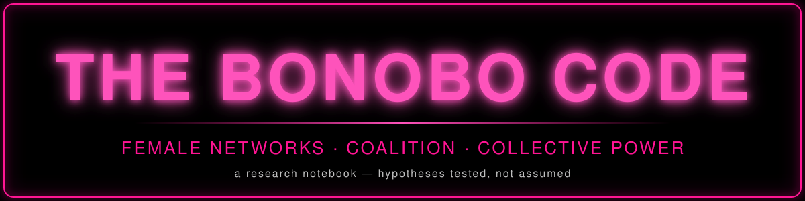

<p align="center">
  
</p>

# The Bonobo Code

A research project investigating the relationship between **female social networks, female coalition, social infrastructure, autonomy, and collective power**.

This is a research notebook, not a manifesto. The goal is to test a hypothesis seriously, including by hunting for evidence that would weaken or disprove it.


## Central research question

> Did the weakening or fragmentation of women's independent social networks contribute to women's dependence on male-centered institutions, and can stronger female social networks increase women's collective autonomy and power?

## Working formulation

> The Bonobo Code investigates whether the fragmentation of women's relationships with one another has weakened women's collective power, and whether rebuilding strong, autonomous female social networks could increase women's ability to support, protect, and empower one another.

## What the project is (and is not) about

The idea is **not** simply "women need more female friends," and it is **not** about wanting a girlfriend.

The concept under test is the **female social ecosystem**: a woman may not need one particular woman; she may need a broader world of women. Whether that is true, and what such a world actually provides that a partner or nuclear household cannot, is an empirical question we try to answer rather than assume.

The progression being investigated:

```
isolated women → connected women → repeated cooperation → coalition → collective capacity → collective power
```

Key working concept, **female social infrastructure**:

> The physical, social, cultural, and digital conditions that allow women to repeatedly encounter, know, support, cooperate with, and organize alongside other women.

Each link in the chain is a hypothesis. Any link may turn out to be weak, conditional, or wrong.


## Working hypothesis

Women's autonomy and collective power depend partly on network properties (density, durability, independence from any single institution), and some modern social arrangements may reduce those properties. See [`hypotheses/core-hypotheses.md`](hypotheses/core-hypotheses.md) (H1–H7), each with supporting evidence, contradictory evidence, alternative explanations, open questions, and falsification criteria.


## Methodology

1. **Question first.** Every research file begins with what we are trying to determine.
2. **Label every claim** with the evidence system below.
3. **Trace to sources.** Every major claim should eventually link to a source. Unsourced material is marked as such.
4. **Seek disconfirmation.** Every section has a *Contradictory evidence* part. A section without one is unfinished.
5. **Name mechanisms.** "Patriarchy" is not an explanation by itself. We specify the proposed mechanism (e.g., co-residence rules, property law, labor markets, violence, ideology) and test it.
6. **State causal uncertainty.** Where historical causation is unclear, we say so.
7. **No anecdote-as-proof.** Contemporary observations (e.g., online spaces) are research prompts, not evidence.

Standard structure for each research file:
*Question → Evidence → Interpretation → Alternative explanations → Contradictory evidence → Open questions → Sources.*

## Evidence labels

| Label | Meaning |
|---|---|
| 🟣 | **Documented fact** — directly recorded and not seriously disputed |
| 🔵 | **Research finding** — result of a specific study; note sample, method, limits |
| 🟢 | **Historical evidence** — from historical records/scholarship |
| 🟡 | **Interpretation** — a reading of the evidence; may be contested |
| 🔴 | **Hypothesis** — untested or partly tested proposal |
| ⚪ | **Contradictory evidence / limitation** — pushes against the hypothesis or bounds what evidence can show |

The 50 conceptual statements in [`notes/50-sentence-conceptual-framework.md`](notes/50-sentence-conceptual-framework.md) are **working ideas (🔴/🟡), not findings** and are never cited as evidence.


## The bonobo comparison

Bonobos (*Pan paniscus*) are a **comparative case, not a blueprint**. The question is not "are humans supposed to behave like bonobos?" but:

> What does bonobo social organization show about the possible social consequences of strong female relationships in a close human relative?

Bonobos are not a peaceful utopia. Aggression, intergroup conflict, and lethal violence (including by female-dominated coalitions) are documented and are part of the picture. See `research/01`–`03`.

## The human comparison

Human research covers female friendship and kin networks, mutual aid, associations and clubs, household structure, digital communities, women's movements and their internal divisions, violence and protection, historical women's institutions, and marriage/singlehood outcomes. See `research/04`–`11`.

## Contradictory evidence requirement

No hypothesis is considered "supported" without a documented attempt to falsify it. Contradictory evidence lives in each research file and is collected in [`hypotheses/contradictory-evidence.md`](hypotheses/contradictory-evidence.md).

## Things this project deliberately does not claim

Patriarchy explains everything; men designed institutions to isolate women; women are naturally peaceful or good; men are inherently bad; bonobos prove a human political theory; female sexuality has one purpose; all women bond with women or need women-only spaces; heterosexual women are less autonomous; evolution is destiny.


## Repository map

```
README.md
assets/
  banner.svg
  divider.svg
docs/
  index.html
research/
  01-bonobo-social-organization.md
  02-female-coalitions.md
  03-female-female-sexuality.md
  04-human-female-social-networks.md
  05-nuclear-family.md
  06-patriarchy-and-social-power.md
  07-womens-movements-and-racial-division.md
  08-digital-female-communities.md
  09-female-violence-and-male-violence.md
  10-historical-female-institutions.md
  11-marriage-and-singlehood.md
evidence/
  primary-sources.md
  academic-studies.md
  historical-sources.md
  datasets.md
hypotheses/
  core-hypotheses.md
  supporting-evidence.md
  contradictory-evidence.md
  open-questions.md
timeline/
  female-social-organization.md
notes/
  working-notes.md
  50-sentence-conceptual-framework.md
```

## Status

Early scaffolding. Source URLs supplied by the project author are recorded in `evidence/academic-studies.md`; details not yet checked against the full text are flagged **[verify]**. Sources cited from general knowledge of the literature are likewise flagged until confirmed.
